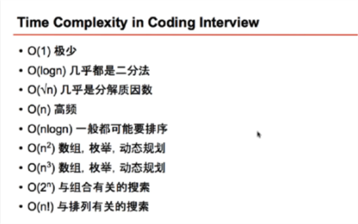
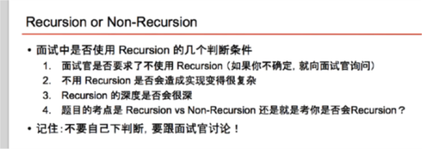

https://zhuanlan.zhihu.com/p/56943330
https://link.zhihu.com/?target=http%3A//wowubuntu.com/markdown/basic.html
https://segmentfault.com/markdown




# Binary Search
#### 时间复杂度  `T(n) = O(1) + T(n/2) = O(1) + T(n/4) + O(1) + T(n/4) ... = O(log n) ` 
`最终T(n) -> T(1) 需要0(log n)次. Ex: 0(8) => 0(8/2) + O(8/4) + O(8/8)`

#### tips
1. over dead loop
   > `start + 1 < end`
2. How to do loop 
3. How to move the point


#### Example
- "Last Postition of Target" [14]
```java
// version 1: with jiuzhang template
public class Solution {
    /**
     * @param nums: An integer array sorted in ascending order
     * @param target: An integer
     * @return an integer
     */
    public int lastPosition(int[] nums, int target) {
        if (nums == null || nums.length == 0) {
            return -1;
        }
        
        int start = 0, end = nums.length - 1;
        while (start + 1 < end) {
            int mid = start + (end - start) / 2;
            if (nums[mid] == target) {
                start = mid;
            } else if (nums[mid] < target) {
                start = mid;
                // or start = mid + 1
            } else {
                end = mid;
                // or end = mid - 1
            }
        }
        
        if (nums[end] == target) {
            return end;
        }
        if (nums[start] == target) {
            return start;
        }
        return -1;
    }
}

- "find-minimum-in-rotated-sorted-array" [159]
public class Solution {
    /**
     * @param nums: a rotated sorted array
     * @return: the minimum number in the array
     */
    public int findMin(int[] nums) {
        // write your code here
        
        if(nums == null && nums.length == 0){
            return -1;
        }
        
        int start = 0;
        int end = nums.length -1;
        // 
        // need find last number to be target. int target = nums[0]; //error
        int target = nums[nums.length -1];// <= last number
        
        while(start + 1 < end){
            int mid = (start + end )/2;
            if(nums[mid] <= target){
                end = mid;
            }else{
                start = mid;// if find first number to be target, will skip the the answer.
            }
        }
        
        if(nums[start] <= target){
            return nums[start];
        }else{
            return end;
        }
    }
}
```

#### Questions
[14]: https://www.lintcode.com/problem/first-position-of-target/description/ 
[458]: https://www.lintcode.com/problem/last-position-of-target/description/ 
[447]: https://www.lintcode.com/problem/search-in-a-big-sorted-array/description
[159]: https://www.lintcode.com/problem/find-minimum-in-rotated-sorted-array/description
[75]: https://www.lintcode.com/problem/find-peak-element/description
[62]: https://www.lintcode.com/problem/search-in-rotated-sorted-array/description
[141]: https://www.lintcode.com/problem/sqrtx/description
[183]: https://www.lintcode.com/problem/wood-cut/description

#####Answer


## Recursion

#### disadvantage
1. Statk