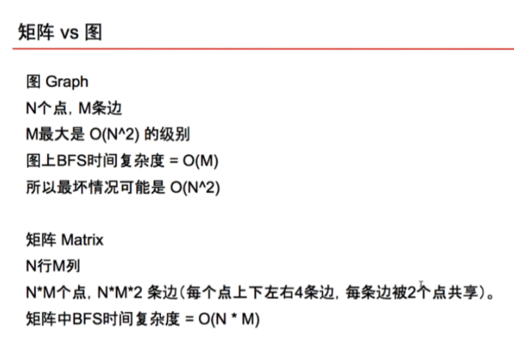

# BFS
- 二叉树上的宽搜 BFS in Binary Tree
- 图上的宽搜 BFS in Graph
   - 拓扑排序 Topological Sorting
- 棋盘上的宽搜 BFS

- When should use BFS?
- 图的遍历 Traversal in Graph
  - 层级遍历 Level Order Traversal
  - 由点及面 Connected Component
  - 拓扑排序 Topological Sorting
- 最短路径 Shortest Path in Simple Graph
  - 仅限简单图求最短路径 
    - (图中每条边，没有方向，没有权重)

## BFS in Binary Tree
- Binary Tree Level Order Traversal
- Serialize and Deserialize Binary Tree (1 more)
     - https://www.lintcode.com/help/binary-tree-representation/
- Binary Tree Level Order Traversal II
- Binary Tree Zigzag Order Traversal
- Convert Binary Tree to Linked Lists by Depth

## BFS in Graph (Undirected)
- Graph Valid Tree
     - initializeGraph
        - Input: n = 5 edges = [[0, 1], [0, 2], [0, 3], [1, 4]]
        - Map<Integer, Set<Integer>>
        - Map<0, [1,2,3]>
        - Map<1, [0,4]>
        - Map<2, [0]>
        - Map<3, [0]>
        - Map<4, [1]>
    - validTree
        - points == edges + 1
        - find all neigbor == points (graph is connected)
    ``` java 
        Map<Integer, Set<Integer>> graph = initializeGraph(n, edges)
        Queue<Integer> myQ = new LinkedList<>();
        Set<Integer> hash = new HashSet<>();
    ```
        
- Clone graph
    - find all nodes
    - mapping old node to new node
    - conncet all edges (copy neighbors)

## Topological Sorting (Directed)
- Topological Sorting
    - collect in-degree
    - put all nodes that indgree = i into queue
    - bfs
- Course Schedule I && II (to-do)
- Sequence Reconstruction (to-do)

## BFS in Matrix 


- Number of Islands (to-do)
- Knight Shortest Path (to-do)
- Build Post Office II (to-do)
