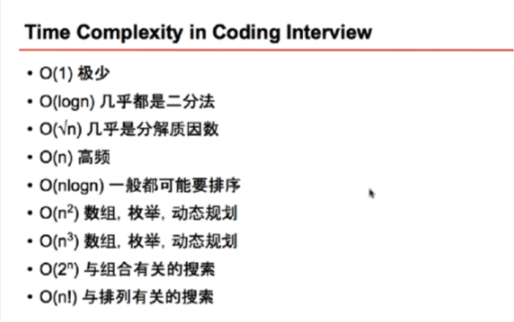
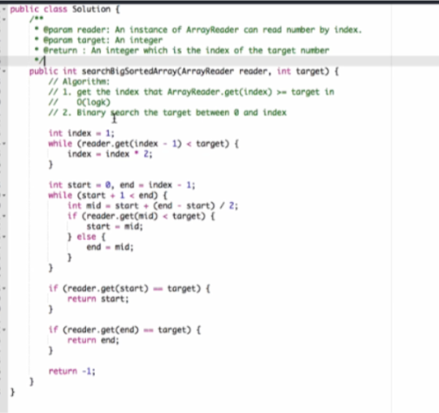
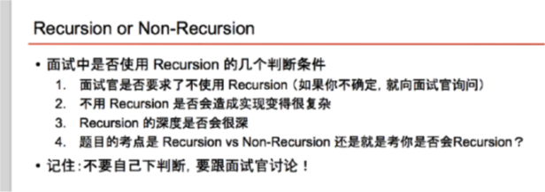

https://zhuanlan.zhihu.com/p/56943330
https://link.zhihu.com/?target=http%3A//wowubuntu.com/markdown/basic.html
https://segmentfault.com/markdown




# Binary Search
#### 时间复杂度  `T(n) = O(1) + T(n/2) = O(1) + T(n/4) + O(1) + T(n/4) ... = O(log n) ` 
`最终T(n) -> T(1) 需要0(log n)次. Ex: 0(8) => 0(8/2) + O(8/4) + O(8/8)`

#### tips
1. over dead loop
   > `start + 1 < end`
2. How to do loop 
3. How to move the point

####
Binary Search
- Given an sorted integer array - nums, and an integer - target.
    - Find the any/first/last position of target in nums
    - Return -1 if target does not exist

#### Practice Questions 
- first-position-of-target [14]
[14]: https://www.lintcode.com/problem/first-position-of-target/description/
- last-position-of-target [458]
[458]: https://www.lintcode.com/problem/last-position-of-target/description/ 
- search-in-a-big-sorted-array [447]
[447]: https://www.lintcode.com/problem/search-in-a-big-sorted-array/description
- find-minimum-in-rotated-sorted-array [159]
[159]: https://www.lintcode.com/problem/find-minimum-in-rotated-sorted-array/description
- Find peak element [75]
[75]: https://www.lintcode.com/problem/find-peak-element/description
- Search in rotated sorted array [62]
[62]: https://www.lintcode.com/problem/search-in-rotated-sorted-array/description
  - 456123, find 0-
  - 456712, find 0
  - 456123, find 7
  - 456712, find 7

- sqrtx [141]
[141]: https://www.lintcode.com/problem/sqrtx/description
- wood-cut [183]
[183]: https://www.lintcode.com/problem/wood-cut/description

#### template
```java
public int function(int[] A, int target) {
        //step 1:
        if(A.length == 0 || A == null){
            return -1;
        }
        
        //step 2:
        int start = x; // Figure out the start, sometime is 0, somethims is 1 or others
        int end = A.length -1;//Figure out the end;
        
         //step 3:
        while(start + 1 < end){
            int mid = start + (end - start)/2; 


            /*detemin start = mid or end = mid base on the question.
             if(A[mid] > target){ // Figure out the start 
                 xxx
                 }
            else if( xxx ){
                xxx
            }else if{
               xxx
            }
            xxx
            xxx
            */ 
        }
        

        //[start,end] the one must be the target
        if(A[start] ==/>=/> target){
            return start;
        }

        if(A[end] ==/>=/> target){
            return end;
        }
        
        return -1;
    }
```


##### Solutions
- wood-cut [183]
```java
public class Solution {
    /**
     * @param L: Given n pieces of wood with length L[i]
     * @param k: An integer
     * @return: The maximum length of the small pieces
     */
    public int woodCut(int[] L, int k) {
        
        if(L == null || L.length == 0){
            return 0;
        }
        
        //error, 0 is impossible
        //int start = 0;
        
        int start = 1;
        int end = 0;
        
        // write your code here
        for(int i = 0; i < L.length ; i++){
            end = Math.max(end,L[i]);
        }
    
        while(start + 1 < end){
            //error 
            //int mid = (start + start ) /2;
            
            int mid = start + (end - start ) /2;
            
            if(counter(L, mid) >= k){
                start = mid;
            }else{
                end = mid;
            }
        }
        
        if(counter(L, end) >= k){ // find the last postion since needs to find maximum length of the small pieces
            return end;
        }
        if(counter(L, start) >= k){
            return start;
        }
        
        return 0;
    }
    
   public int counter(int [] L, int value){
       int sum = 0;
        
        for(int i = 0; i < L.length ; i++){
            sum += L[i]/value;
        }
        
        return sum;
    }
}
```

- sqrtx [141]
```java
public class Solution {
    /**
     * @param x: An integer
     * @return: The sqrt of x
     */
    public int sqrt(int x) {
        // write your code here
        
        if(x <= 0 ){
            return 0;
        }
        
        int start = 1;
        int end  = x;
        
        while(start + 1 < end){
          
            //error,overflow
            // if(mid * mid == x){
            //     return mid;
            // }
            // if(mid * mid  <= x){
            //      start = mid;
            // }else{
            //     end = mid;
            // }
            
            int mid = start + (end - start) / 2;
            // writing in this way instead of "nums[mid] * nums[mid]" to avoid overflow
            if (mid == x / mid)  return mid;
            // possible root must be larger than or equal to current mid
            else if (mid < x / mid) start = mid;
            // possible root must be smaller than or equal to current mid
            else  end = mid;
            
        }
        
        //error
        // if(start * start < x){
        //     return start;
        // }else{
        //     return end;
        // }
        
        if (end > x / end)  return start;
        return end;
    }
}
```

- search in rotated sorted array [447]
```java
public class Solution {
    /**
     * @param A: an integer rotated sorted array
     * @param target: an integer to be searched
     * @return: an integer
     */
    public int search(int[] A, int target) {
        // write your code here
        
        if(A.length == 0 || A == null){
            return -1;
        }
        
        int start = 0;
        int end = A.length -1;
        
        while(start + 1 < end){
            int mid = (start+end)/2;
            
            if (A[mid] == target){ //error missed
                return mid;
            }
            
            if(A[mid] > A[0]){
                if(target >= A[0] && target < A[mid]){
                    end = mid;
                }else{
                    start = mid;
                }
            }else if(A[mid] <= A[0] ){
                if (target >= A[mid] && target < A[0]) {
                    start = mid;
                }else{
                    end = mid;
                }
            }
        }
        
        if(A[start] == target){
            return start;
        }
        
        if(A[end] == target){
            return end;
        }
        
        return -1;
    }
}
```
- last position of target [458]
```java
// version 1: with jiuzhang template
public class Solution {
    /**
     * @param nums: An integer array sorted in ascending order
     * @param target: An integer
     * @return an integer
     */
    public int lastPosition(int[] nums, int target) {
        if (nums == null || nums.length == 0) {
            return -1;
        }
        
        int start = 0, end = nums.length - 1;
        while (start + 1 < end) {
            int mid = start + (end - start) / 2;
            if (nums[mid] == target) {
                start = mid;
            } else if (nums[mid] < target) {
                start = mid;
                // or start = mid + 1
            } else {
                end = mid;
                // or end = mid - 1
            }
        }
        
        if (nums[end] == target) {
            return end;
        }
        if (nums[start] == target) {
            return start;
        }
        return -1;
    }
}
```

- "find-minimum-in-rotated-sorted-array" [159]
```java
public class Solution {
    /**
     * @param nums: a rotated sorted array
     * @return: the minimum number in the array
     */
    public int findMin(int[] nums) {
        // write your code here
        
        if(nums == null && nums.length == 0){
            return -1;
        }
        
        int start = 0;
        int end = nums.length -1;
        // 
        // need find last number to be target. int target = nums[0]; //error
        int target = nums[nums.length -1];// <= last number
        
        while(start + 1 < end){
            int mid = (start + end )/2;
            if(nums[mid] <= target){
                end = mid;
            }else{
                start = mid;// if find first number to be target, will skip the the answer.
            }
        }
        
        if(nums[start] <= target){
            return nums[start];
        }else{
            return end;
        }
    }
}
```

- find-peak-element [75]
```java
public class Solution {
    /**
     * @param A: An integers array.
     * @return: return any of peek positions.
     */
    public int findPeak(int[] A) {
        // write your code here
        
        if(A == null || A.length == 0){
            return -1;
        }
        
        int start = 0;
        int end  =  A.length -2; //prevent overflow,error missed
        
        //my solution
        // while (start + 1 < end){
        //     int mid = (start + end)/2;
        //     if(A[mid] > A[mid + 1] && A[mid -1] < A[mid]){
        //         return mid;
        //     }else if(A[mid] < A[mid + 1] && A[mid -1] < A[mid] ){
        //         start = mid;
        //     }else{
        //         end = mid;
        //     }
        // }

        while (start + 1 < end){
            int mid = (start + end)/2;
            if(A[mid] > A[mid + 1] ){
                end = mid;
            }else if(A[mid] < A[mid + 1]){
                start = mid;
            }else{
                end = mid;
            }
        }

        
        if(A[start] > A[end]){
            return start;
        }else{
            return end;
        }
    }
}
```

- find-minimum-in-rotated-sorted-array [159]
```java
public class Solution {
    /**
     * @param nums: a rotated sorted array
     * @return: the minimum number in the array
     */
    public int findMin(int[] nums) {
        // write your code here
        
        if(nums == null && nums.length == 0){
            return -1;
        }
        
        int start = 0;
        int end = nums.length -1;
        int target = nums[end];
        
        while(start + 1 < end){
            int mid = (start + end) /2;
            if(nums[mid] > target){
                start =  mid;
            }else if(nums[mid] < target){
                end = mid;
            }else{
               end = mid;
            }
        }
        
        if(nums[start] <= target){
            return nums[start];
        }else{
            return nums[end];
        }
    }
}
```



## Recursion

#### disadvantage
1. Statk