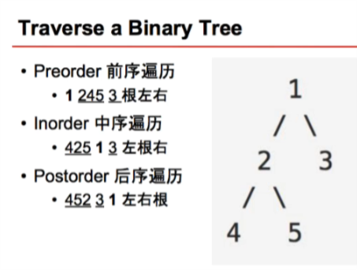
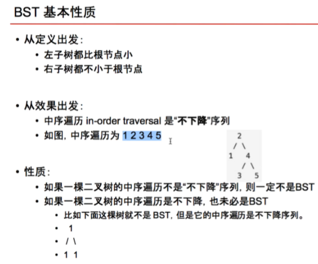

# Binary Tree & Divide Conquer

## Time Complexity
In O(n) time, make n to be two n/2. What is time complexity? \
    T(n) = O(n) + 2 T(n/2)\
         = O(n) + 2 ( O(n/2) + 2 T(n/4))\ = 2 O(n) + 4 T(n/4)) = 3 O(n) + 8 T(n/ 8))\
         = ...\
         = 4 O(n) + 16 T(n/ 16))\
         = O(n log n) +  n O(1) \
         = O(n log n)

In O(1) time, make n to be n/2. What is time complexity? \
 T(n) = O(1) + 2 T(n/2)\
         = O(1) + 2 ( O(n/2) + 2 T(n/4)) = 2 O(1) + 4 T(n/4)) = 3 O(1) + 8 T(n/ 8))\
         = ...\
         = O(log n) +  n O(1) \
         = O(n)

## Traverse in Binary Tree



- Maximum Depth of Binary Tree [97]
- Binary Tree Paths [480]    (1 more)  
- Minimum Subtree [596]   (1 more)  
- Balanced-binary-tree [93] (1 more)  
- binary-tree-level-order-traversal [69] (todo)
- binary-tree-level-order-traversal II [70] (todo)
- Binary Tree Maximum Node [632]
- Subtree with Maximum Average [597]
- Flatten Binary Tree to Linked List [597]
- Lowest Common Ancestor of a Binary Tree [88]
- Lowest Common Ancestor of a Binary Tree II (todo)
- Lowest Common Ancestor of a Binary Tree III (todo)
- Binary Tree Longest Consecutive Sequence [595]
- Binary Tree Longest Consecutive Sequence II  (todo)
- Binary Tree Longest Consecutive Sequence III  (todo)
- Binary Tree Path Sum I
- Binary Tree Path Sum II  (todo)
- Binary Tree Path Sum III (todo)


### Binary Search Tree
#### Insert/Remove/Find/Validate O(h)


BST defination: 
    -  left < root, right >= root
    - in-order traversal: never decrease,but never decrease hasn't to be BST


- Validate Binary Search Tree [95]
- 
- convert-binary-search-tree-to-doubly-linked-list
https://www.jiuzhang.com/solution/convert-binary-search-tree-to-doubly-linked-list/


### Preorder  Root L R 
https://www.lintcode.com/problem/binary-tree-preorder-traversal/

```java
Version 0: Non-Recursion (Recommend)
/**
 * Definition for binary tree
 * public class TreeNode {
 *     int val;
 *     TreeNode left;
 *     TreeNode right;
 *     TreeNode(int x) { val = x; }
 * }
 */
public class Solution {
    public List<Integer> preorderTraversal(TreeNode root) {
        Stack<TreeNode> stack = new Stack<TreeNode>();
        List<Integer> preorder = new ArrayList<Integer>();
        
        if (root == null) {
            return preorder;
        }
        
        stack.push(root);
        while (!stack.empty()) {
            TreeNode node = stack.pop();
            preorder.add(node.val);
            if (node.right != null) {
                stack.push(node.right);
            }
            if (node.left != null) {
                stack.push(node.left);
            }
        }
        
        return preorder;
    }
}

//Version 1: Traverse
public class Solution {
    public ArrayList<Integer> preorderTraversal(TreeNode root) {
        ArrayList<Integer> result = new ArrayList<Integer>();
        traverse(root, result);
        return result;
    }
    // 把root为跟的preorder加入result里面
    private void traverse(TreeNode root, ArrayList<Integer> result) {
        if (root == null) {
            return;
        }

        result.add(root.val);
        traverse(root.left, result);
        traverse(root.right, result);
    }
}

//Version 2: Divide & Conquer
public class Solution {
    public ArrayList<Integer> preorderTraversal(TreeNode root) {
        ArrayList<Integer> result = new ArrayList<Integer>();
        // null or leaf
        if (root == null) {
            return result;
        }

        // Divide
        ArrayList<Integer> left = preorderTraversal(root.left);
        ArrayList<Integer> right = preorderTraversal(root.right);

        // Conquer
        result.add(root.val);
        result.addAll(left);
        result.addAll(right);
        return result;
    }
}
```
### Inorder  L Root R
https://www.lintcode.com/en/problem/binary-tree-inorder-traversal/


```java
public class Solution {
    /**
    1) Create an empty stack S.
    2) Initialize current node as root
    3) Push the current node to S and set current = current->left until current is NULL
    4) If current is NULL and stack is not empty then 
        a) Pop the top item from stack.
        b) Print the popped item, set current = popped_item->right 
        c) Go to step 3.
    5) If current is NULL and stack is empty then we are done.
     * @param root: The root of binary tree.
     * @return: Inorder in ArrayList which contains node values.
     */

     
    /* Class to print the inorder traversal */
class BinaryTree 
{ 
    Node root; 
    void inorder() 
    { 
        if (root == null) 
            return; 
    
        Stack<Node> s = new Stack<Node>(); 
        Node curr = root; 
  
        // traverse the tree 
        while (curr != null || s.size() > 0) 
        { 
            /* Reach the left most Node of the 
            curr Node */
            while (curr !=  null) 
            { 
                /* place pointer to a tree node on 
                   the stack before traversing 
                  the node's left subtree */
                s.push(curr); 
                curr = curr.left; 
            } 
  
            /* Current must be NULL at this point */
            curr = s.pop(); 
  
            System.out.print(curr.data + " "); 
  
            /* we have visited the node and its 
               left subtree.  Now, it's right 
               subtree's turn */
            curr = curr.right; 
        } 
    } 
```
### Postorder  L R ROOT
https://www.lintcode.com/problem/binary-tree-postorder-traversal/
```java
//Recursive
public ArrayList<Integer> postorderTraversal(TreeNode root) {
    ArrayList<Integer> result = new ArrayList<Integer>();

    if (root == null) {
        return result;
    }

    result.addAll(postorderTraversal(root.left));
    result.addAll(postorderTraversal(root.right));
    result.add(root.val);

    return result;   
}

/*
                    1 
                /       \ 
               2          3 
             /   \       /  \ 
            4    5      6    7 
 
crur    pre    stack           result
1       null    12                   
2       1       124                  
4       2       124                  
4       4       12             4                  
2       4       125                              
5       2       125                              
5       5       12             45                  
2       5       12                               
2       2       1             452                 
1       2       13                              
3       1       136                              
6       3       136                              
6       6       13           4526                   
3       6       137                             
7       3       137                             
7       7       13           45267               
3       7       13                          
3       3       1            452673              
1       3                    4526731              
 */
public ArrayList<Integer> postorderTraversal(TreeNode root) {
    ArrayList<Integer> result = new ArrayList<Integer>();
    Stack<TreeNode> stack = new Stack<TreeNode>();
    TreeNode prev = null; // previously traversed node
    TreeNode curr = root;

    if (root == null) {
        return result;
    }

    stack.push(root);
    while (!stack.empty()) {
        curr = stack.peek();
        if (prev == null || prev.left == curr || prev.right == curr) { // traverse down the tree
            if (curr.left != null) {
                stack.push(curr.left);
            } else if (curr.right != null) {
                stack.push(curr.right);
            }
        } else if (curr.left == prev) { // traverse up the tree from the left
            if (curr.right != null) {
                stack.push(curr.right);
            }
        } else { // traverse up the tree from the right
            result.add(curr.val);
            stack.pop();
        }
        prev = curr;
    }

    return result;
}


/*
                    1 
                /       \ 
               2          3 
             /   \       /  \ 
            4    5      6    7 
 
pop     stackAfterPop     statckAftePush        result
1        null               3 2                    1
2        3                  3 5 4                1 2 
4        3 5                3 5                  1 2 4
5        3                  3                    1 2 4 5
3        null               7 6                  1 2 4 5 3
6        7                  7                    1 2 4 5 3 6
7        null               null                 1 2 4 5 3 6 7
 */
public class Solution {
    public List<Integer> preorderTraversal(TreeNode root) {
        Stack<TreeNode> stack = new Stack<TreeNode>();
        List<Integer> preorder = new ArrayList<Integer>();
        
        if (root == null) { return preorder; }
        
        stack.push(root);
        while (!stack.empty()) {
            TreeNode node = stack.pop();
            preorder.add(node.val);
            if (node.right != null) {
                stack.push(node.right);
            }
            if (node.left != null) {
                stack.push(node.left);
            }
        }
        
        return preorder;
    }
}


public class Solution {
    /**
     * @param root: The root of binary tree.
     * @return: Inorder in ArrayList which contains node values.
     */
    public ArrayList<Integer> inorderTraversal(TreeNode root) {
        Stack<TreeNode> stack = new Stack<>();
        ArrayList<Integer> result = new ArrayList<>();
        
        while (root != null) {
            stack.push(root);
            root = root.left;
        }
    
        while (!stack.isEmpty()) {
            TreeNode node = stack.peek();
            result.add(node.val);
            
            if (node.right == null) {
                node = stack.pop();
                while (!stack.isEmpty() && stack.peek().right == node) {
                    node = stack.pop();
                }
            } else {
                node = node.right;
                while (node != null) {
                    stack.push(node);
                    node = node.left;
                }
            }
        }
        return result;
    }
}

public class Solution {
    /**
     * @param root: A Tree
     * @return: Level order a list of lists of integer
     */
    public List<List<Integer>> levelOrder(TreeNode root) {
        
        List resule = new ArrayList();
        // write your code here
        Queue<TreeNode> q =  new LinkedList<TreeNode>();
       
        if(root == null){
            return resule;
        }
        q.offer(root);
   
        while(!q.isEmpty()){
            ArrayList<Integer> level = new ArrayList<Integer>();
            
            int qSize = q.size();
            for(int i = 0; i <qSize; i++){
                TreeNode node = q.poll();
                level.add(node.val);
                if(node.left != null){
                    q.offer(node.left);
                }
                 if(node.right != null){
                    q.offer(node.right);
                }
            }
            resule.add(level);
        }
        return resule;
    }  
}


/*
                    1 
                /       \ 
               2          3 
                \        
                  5    
Left:
    root -> left -> [right -> path add 5]
    root -> [left -> root.ley(2) + rightPaths(5)]
    root.key +  [left -> root.ley(2) + rightPaths(5)]


    root -> binaryTreePaths(left) 2
             -> binaryTreePaths(right) 
                ->paths add 5

    root -> binaryTreePaths(left) 2
             -> binaryTreePaths(right) 
                ->return paths(5) 
    
   root -> binaryTreePaths(left) 2
             -> 2 + paths (5)  

    1 +  2 + paths (5) = 1->2> 5

    right 2 path 5
    left 1 path 2->5
    right 1 path 3
    1->2->5, 1->3]

Right:
    root -> [right -> path add 3]
    root.key +  [right -> path add 3]
*/

 public static  List<String> binaryTreePaths(Node root) {
        List<String> paths = new ArrayList<>();
        if (root == null) {
            return paths;
        }

        List<String> leftPaths = binaryTreePaths(root.left);
        List<String> rightPaths = binaryTreePaths(root.right);
        for (String path : leftPaths) {
            paths.add(root.key + "->" + path);
            System.out.println( "left " +  (root.key));
        }
        for (String path : rightPaths) {
            paths.add(root.key + "->" + path);
            System.out.println( "right " +  (root.key));
        }

        // root is a leaf
        if (paths.size() == 0) {
            paths.add("" + root.key);
            //System.out.println( "leaf " +  (root.key));
        }

        return paths;
    }


/******************************
- Balanced-binary-tree [93]
******************************/

//Version 1: with ResultType
class ResultType {
    public boolean isBalanced;
    public int maxDepth;
    public ResultType(boolean isBalanced, int maxDepth) {
        this.isBalanced = isBalanced;
        this.maxDepth = maxDepth;
    }
}

public class Solution {
    /**
     * @param root: The root of binary tree.
     * @return: True if this Binary tree is Balanced, or false.
     */
    public boolean isBalanced(TreeNode root) {
        return helper(root).isBalanced;
    }
    
    private ResultType helper(TreeNode root) {
        if (root == null) {
            return new ResultType(true, 0);
        }
        
        ResultType left = helper(root.left);
        ResultType right = helper(root.right);
        
        // subtree not balance
        if (!left.isBalanced || !right.isBalanced) {
            return new ResultType(false, -1);
        }
        
        // root not balance
        if (Math.abs(left.maxDepth - right.maxDepth) > 1) {
            return new ResultType(false, -1);
        }
        
        return new ResultType(true, Math.max(left.maxDepth, right.maxDepth) + 1);
    }
}


// Version 2: without ResultType
public class Solution {
    public boolean isBalanced(TreeNode root) {
        return maxDepth(root) != -1;
    }

    private int maxDepth(TreeNode root) {
        if (root == null) {
            return 0;
        }

        int left = maxDepth(root.left);
        int right = maxDepth(root.right);
        if (left == -1 || right == -1 || Math.abs(left-right) > 1) {
            return -1;
        }
        return Math.max(left, right) + 1;
    }
}

/*******************************
subtree-with-maximum-average
*******************************/
// version 1: Traverse + Divide Conquer
public class Solution {
    private class ResultType {
        public int sum, size;
        public ResultType(int sum, int size) {
            this.sum = sum;
            this.size = size;
        }
    }
    
    private TreeNode subtree = null;
    private ResultType subtreeResult = null;
    
    /**
     * @param root the root of binary tree
     * @return the root of the maximum average of subtree
     */
    public TreeNode findSubtree2(TreeNode root) {
        helper(root);
        return subtree;
    }
    
    private ResultType helper(TreeNode root) {

        if (root == null) {
            return new ResultType(0, 0);
        }
        // 分治法计算左右子树的平均值
        ResultType left = helper(root.left);
        ResultType right = helper(root.right);

        // 当前subtree的结果是左右两颗子树的和的平均值加上自身
        ResultType result = new ResultType(
            left.sum + right.sum + root.val,
            left.size + right.size + 1
        );
        // 打擂台比较得到最大平均值的子树
        if (subtree == null ||subtreeResult.sum * result.size < result.sum * subtreeResult.size) {
            subtree = root;
            subtreeResult = result;
        }
        return result;
    }
}

/*******************************
Flatten Binary Tree to Linked List
*******************************/
// Version 1: Traverse
public class Solution {
    private TreeNode lastNode = null;

    public void flatten(TreeNode root) {
        if (root == null) {
            return;
        }

        if (lastNode != null) {
            lastNode.left = null;
            lastNode.right = root;
        }

        lastNode = root;
        TreeNode right = root.right;
        flatten(root.left);
        flatten(right);
    }
}

// version 2: Divide & Conquer
public class Solution {
    /**
     * @param root: a TreeNode, the root of the binary tree
     * @return: nothing
     */
    public void flatten(TreeNode root) {
        helper(root);
    }
    
    // flatten root and return the last node
    private TreeNode helper(TreeNode root) {
        if (root == null) {
            return null;
        }
        
        TreeNode leftLast = helper(root.left);
        TreeNode rightLast = helper(root.right);
        
        // connect leftLast to root.right
        if (leftLast != null) {
            leftLast.right = root.right;
            root.right = root.left;
            root.left = null;
        }
        
        if (rightLast != null) {
            return rightLast;
        }
        
        if (leftLast != null) {
            return leftLast;
        }
        
        return root;
    }
}

// version 3: Non-Recursion
/**
 * Definition of TreeNode:
 * public class TreeNode {
 *     public int val;
 *     public TreeNode left, right;
 *     public TreeNode(int val) {
 *         this.val = val;
 *         this.left = this.right = null;
 *     }
 * }
 */
public class Solution {
    /**
     * @param root: a TreeNode, the root of the binary tree
     * @return: nothing
     */
    public void flatten(TreeNode root) {
        if (root == null) {
            return;
        }
        
        Stack<TreeNode> stack = new Stack<>();
        stack.push(root);
        
        while (!stack.empty()) {
            TreeNode node = stack.pop();
            if (node.right != null) {
                stack.push(node.right);
            }
            if (node.left != null) {
                stack.push(node.left);
            }
            
            // connect 
            node.left = null;
            if (stack.empty()) {
                node.right = null;
            } else {
                node.right = stack.peek();
            }
        }
    }
}
```