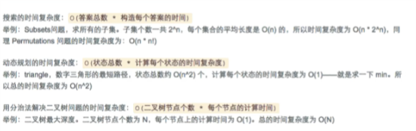
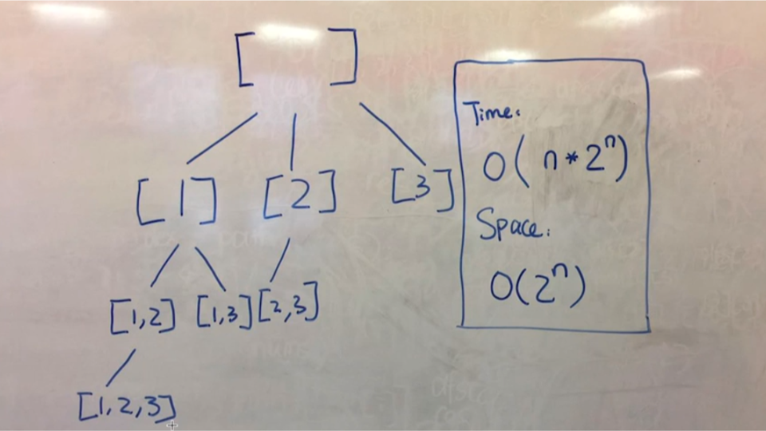

# DFS

## 问题模型：求出所有满足条件的“组合”。
判断条件：组合中的元素是顺序无关的。
时间复杂度：与 2^n 相关
- 
## Recursion
## Combination
- subsets
    - 
    - 递归三要素
        - 1. 递归的定义在 Nums 中找到所有以 subset 开头的的集合，并放到 results
        - 2. 递归的拆解
        - 3. 递归的出口
- Combination Sum
    - remove depulcation
    - sort
- Combination Sum II
- Palindrome Partitioning

   
## Permutation
    - 问题模型：求出所有满足条件的“排列”。
    - 判断条件：组合中的元素是顺序“相关”的。
    - 时间复杂度：与 n! 相关。

- Permutations
    - if(temp.contains(nums[i])){
            continue;
        }
- Permutations II
- N Queens

## Search in a Graph
    - Word Ladder
    - Word Ladder II
## Stack Non-Recursion
    - Expression Expand
    - Implement Queue by Two Stacks
    - 
## Iterator
    - Flatten Nested List Iterator