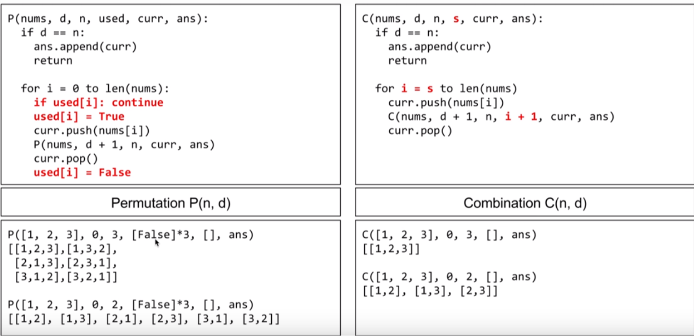

# DFS

### 问题模型：求出所有满足条件的“组合”。
判断条件：组合中的元素是顺序无关的。
时间复杂度：与 2^n 相关
### Recursion
- 

## Permutaion VS combination
- 无顺序，有顺序

### Combination
- subsets (No dup)  (one more)
    - 
    - 递归三要素
        - 1. 递归的定义在 Nums 中找到所有以 subset 开头的的集合，并放到 results
        - 2. 递归的拆解
        - 3. 递归的出口
- Combination Sum (dup) (one more)
    - sort
    - remove depulcation
    - DFS
- Combination Sum II (one more)
- Palindrome Partitioning (one more)

### Permutation 

    - 问题模型：求出所有满足条件的“排列”。
    - 判断条件：组合中的元素是顺序“相关”的。
    - 时间复杂度：与 n! 相关。

- Permutations (one more)
    - if(temp.contains(nums[i])){
            continue;
        }
- Permutations II (to do)
- N Queens (to do)

## Search in a Graph (to do)
    - Word Ladder
    - Word Ladder II
## Stack Non-Recursion 
    - Expression Expand (to do)
    - Implement Queue by Two Stacks  (one more)
## Iterator
    - Flatten Nested List Iterator