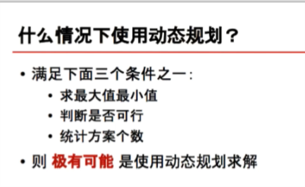
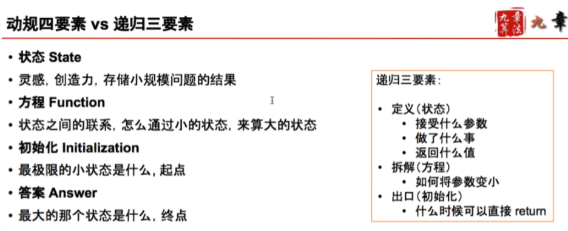

 

## 通过一道经典题理解动态规划
- 递归与动规的联系与区别
- 记忆化搜索
- 什么时候使用动态规划
- 适用动态规划的三个条件
- 不适用动态规划的三个条件
- 动规四要素 vs 递归三要素
 
- 面试中常见动态规划的分类
- 坐标（矩阵）动态规划
- 接龙型动态规划

- Triangle
- Unique Paths
- Jump Game
- Longest Increasing Subsequence
    -  将n个数看做n个木桩，目的是从某个木桩出发，从前向后，从低往高，看做多能踩多少个木桩。
    - state: f[i] 表示（从任意某个木桩）跳到第i个木桩，最多踩过多少根木桩
    - function: f[i] = max{f[j] + 1}, j必须满足 j < i && nums[j] < nums[i]
    - initialize: f[0..n-1] = 1
    - answer: max{f[0..n-1]}