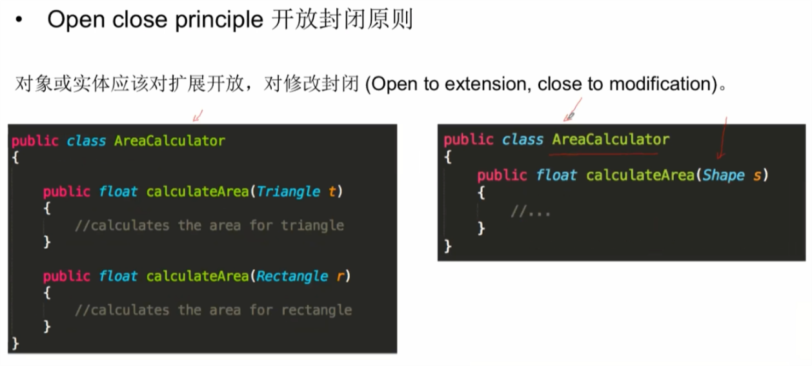
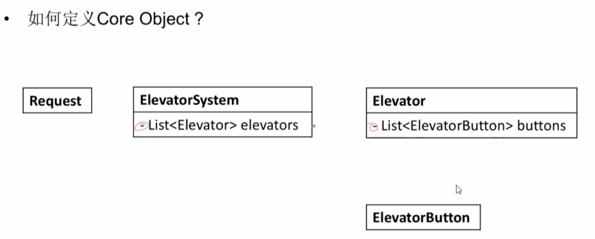
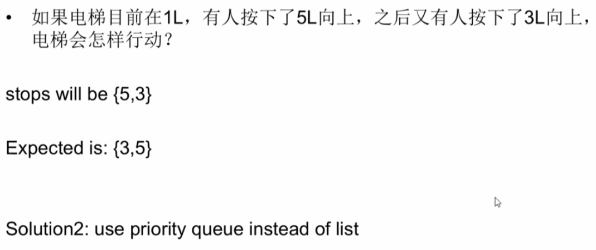
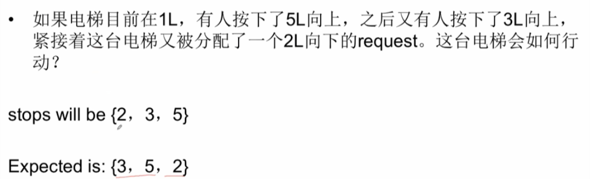
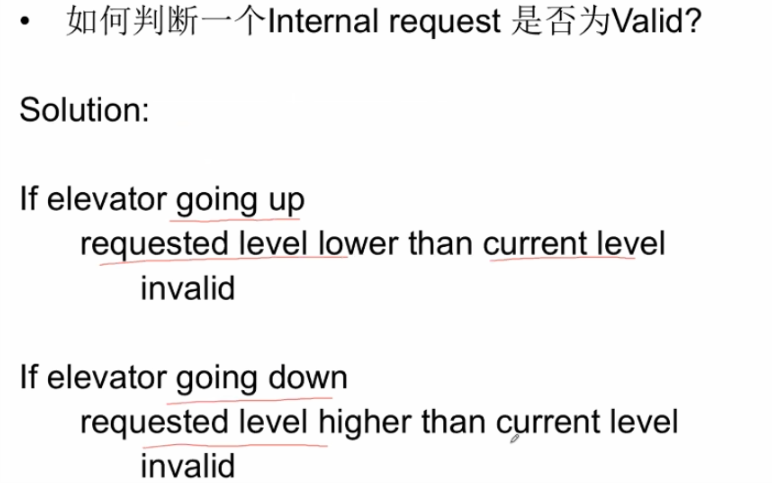
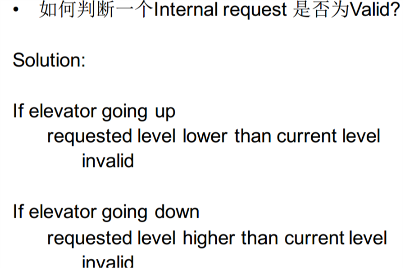
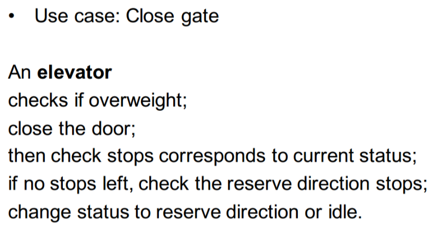
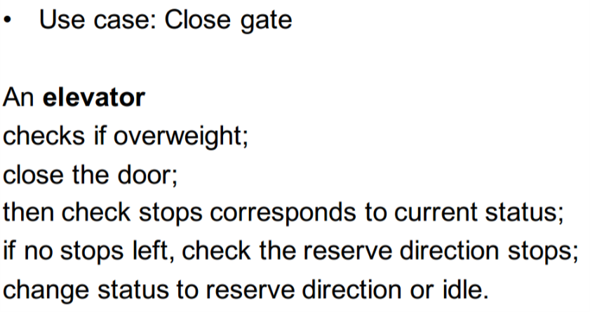

#### 区分 OOD / system design 问题

SOLID 原则
- Single responsibibility principle
- Open close principle
    - Open to extension, close to modification
    - 
- Liskov substitution principle
    - 任何一个子类或派生类应该可以替换它们的基类或父类
        - 下面的例子就违反了Liskov substitution principle，因为Rectangle没有Area，子类Rectangle 不能替换父类shape
    ``` java
    public class Shape {
        abstract public float calculateVolume();
        abstract public float calculateArea();
    }

    public class Rectangle extends Shape{

    }

    public class Cube extends Shape{
        
    }
    ```
- Interface segregation principle
    - 不应该强迫一个类实现它用不上的接口
        - 强迫Rectangle 实现它本身用不上的接口 calculateArea()
    ``` java
    public class Shape {
        abstract public float calculateVolume();
        abstract public float calculateArea();
    }

    public class Rectangle extends Shape{

    }

    public class Cube extends Shape{
        
    }
    ```

- Dependency inversion principle 
    - 抽象不应该依赖于具体实现，具体实现应该依赖于抽象

    ``` java 
    public class AreaCalculator {
        private float result;

        public float getResult(){
            return this.result;
        }

        //第一种方法，抽象依赖于具体实现
        public float calculateArea(){
            if(s == Triangle){
                this.result = b*h/2;
            }else if(s == Rectangle){
                this.result = l*w;
            }
        }
    }
    ```
    ``` java 
    public interface Shape{
        public float getArea();

    }

    public class Triangle implements Shape{
        public float getArea(){
            return b*h/2;
        }
    }

     public class AreaCalculator {
        private float result;

        public float getResult(){
            return this.result;
        }

        //第二种方法，具体实现依赖于抽象
        public float calculateArea(Shape s){
          this.result = s.getArea();
        }
    }
    ```
## Example
- Can you design an elevator system for this building?

### 5C
- Clarify
    - 说人话：通过和面试官交流，去除题目中的歧义，确定答题范围
        - What
            - elevator
                - size
                - stats
                    - working
                    - maintain
                    - static
                    - floor
                - load
                    - check load
                - 客梯/货梯
            - building
                - total floor
                - how many elevaors will get notify by a click?
        - How
            - 针对问题主题的规则来ᨀ问，帮助自己明确解题方向
            - 当按下按钮时，哪一台电梯会相应？
                -  同方向 > 静止 > 反向
            - 当电梯在运行时，哪些按键可以响应
                - 是否能按下反向的楼层

- Core objects
    - 说人话：确定题目所涉及的类，以及类之间的映射关系
    - 为了完成设计，需要哪些类？
        - 以一个Object作为基础，线性思考
        - 确定Objects之间的映射关系
    - 
    - 用”+”表示一个变量或者函数为public
    - 用”-”表示一个变量或者函数为private
    - 用”#”表示一个变量或者函数为protected

- Cases
    - 说人话：确定题目中所需要实现的场景和功能
        - ElevatorSystem
            - handle request
        - ExternalRequest
            - send request
        - Elevator
            - take external request
            - take internal request
            - open gate
            - close gate
            - check weight 

- Classes
    - 说人话：通过类图的方式，具体填充题目中涉及的类
        - Class Name
            - Attributes
            - Functions
    - Use Case: take external request
        - Add Exception
            - InvalidExternalRequestException
            - InvalidMaintainRequestException
        - Add enumeration
        - Min heap/ priority queue
            - 
            - 
            - 
    - Use Case: take internal request
        - int level
        - 
    - Use Case: open gate
        - 
    - Use Case: check weight
        - An elevator checks its current weight and compare with limit to see if overweight
    - Use Case: close gate
        - 
    - Use Case: Elevator Button
        - int level
        - Elevator elevator
        - internalRequest PressButton()

    - [final view](./assets/oc9.png)

- Correctness
    - 说人话：检查自己的设计，是否满足关键点
        - [final view](./assets/oc9.png)


## Question:
- abstract VS interface
    - In java, a class can inherit only one abstract class, but can impl multiple interface 
- AreaCalculator to aclculat the Rectangle,Cube