### What if I want to apply different ways to handle external requests during different time of a day?

```java
//Solution 1
public void handleRequest( ExternalRequest r){
    if(time == TIME.PEAK){
        // use peak hour handler
    }else if(time == TIME.NORMAL){
        // use normal hor handler
    }
}
```
- Solution 2
    - 封装了多种 算法/策略
    - 使得算法/策略之间能够互相替换
    - 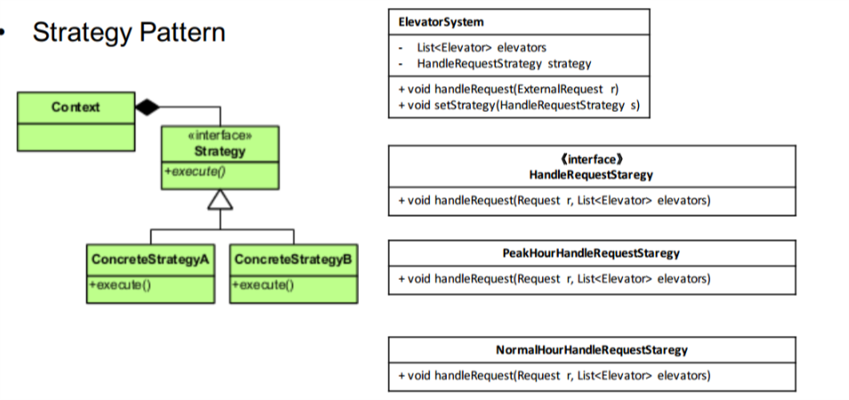
    - 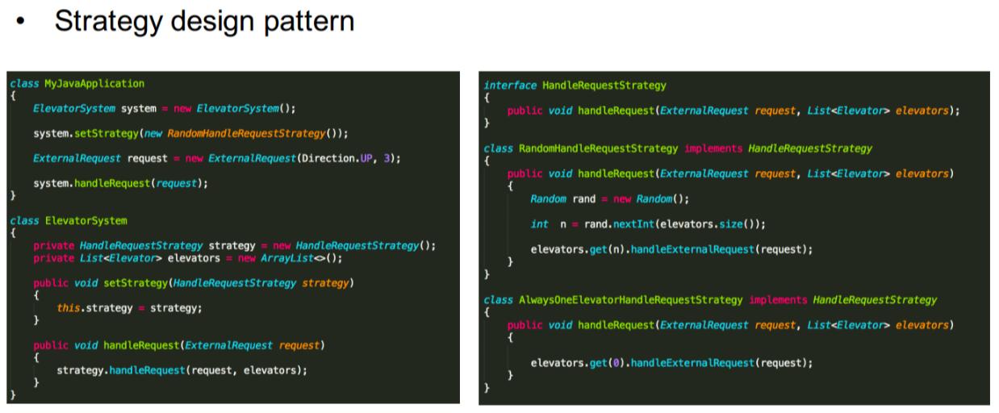


## Parking lot
- Clarify What/How/Who
    - What
        - Vehicle
            - bus
            - car
        - Parking lot, 露天的？双层的？楼层的？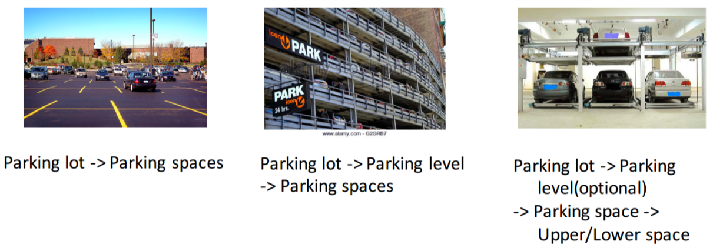
        - Parking Spot
            - size?
            - electric parking？
            - disabled

    - How
        - parking different vechicle?
            - bus can use mutipule normal car spot/ has specific spot?
        - how to parking? (从systemc出发，而不是从人)
            - 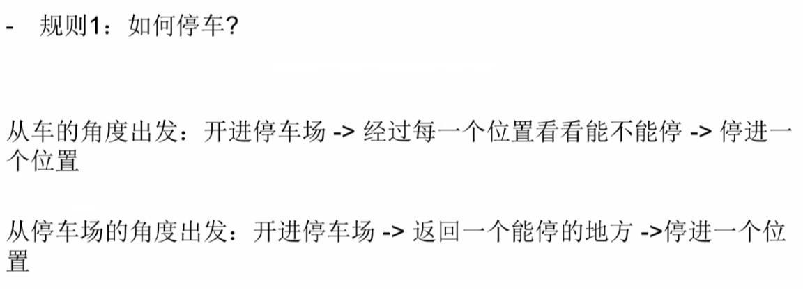
        - display free parking spot
        - billing
            - base on hours
    - who
        - N/A

- Core Object
    - input/output
     - 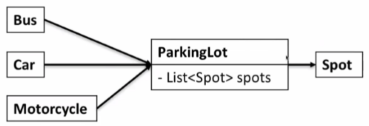
- Use Case
    - Reserve
        - N/A
    - Serve
        - ParkingLot
            - get available count per level to display
        - park vehicle
    - Check out
        - clear spot
        - Calculate price
- Class
- 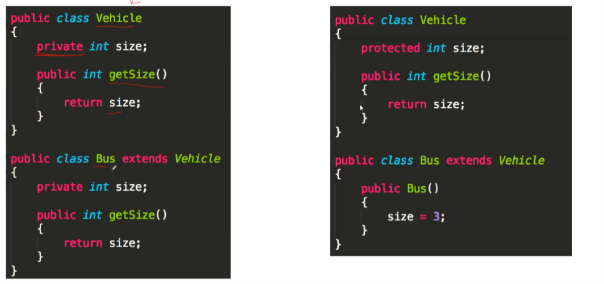
    - Use case: Park vehicle
        - Parking lot checks the size of vehicle
        - Parking lot find an available spot for this vehicle
        - Vehicle takes the spot(s)
    - Use case: Clear spot
        - Parking lot find the spot to clear
        - Update spot to be available
    - Use case: Calculate price
        - When clear spot, parking lot calculates the expected price to pay

- 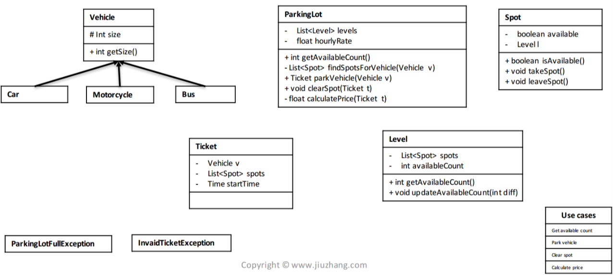

- Parking lot里每层的spots，是怎么排列的？当停Bus时，是否有问题？
    - 像添加Level一样，添加一个Row作为新的Class 
    - 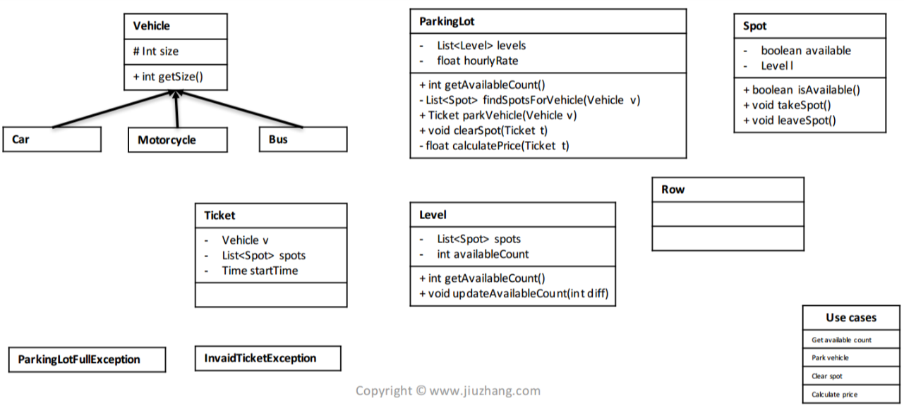


### Design pattern
- Singleton
ensure a class has only one instance, and provide a global point of access to it
- 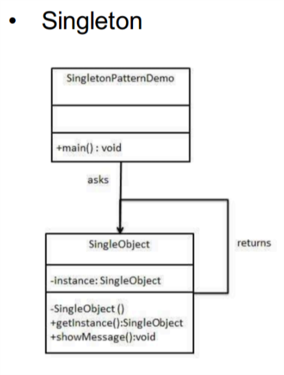
- 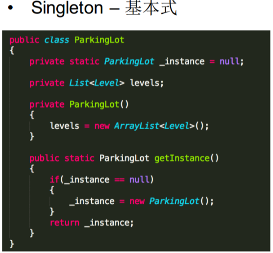
- 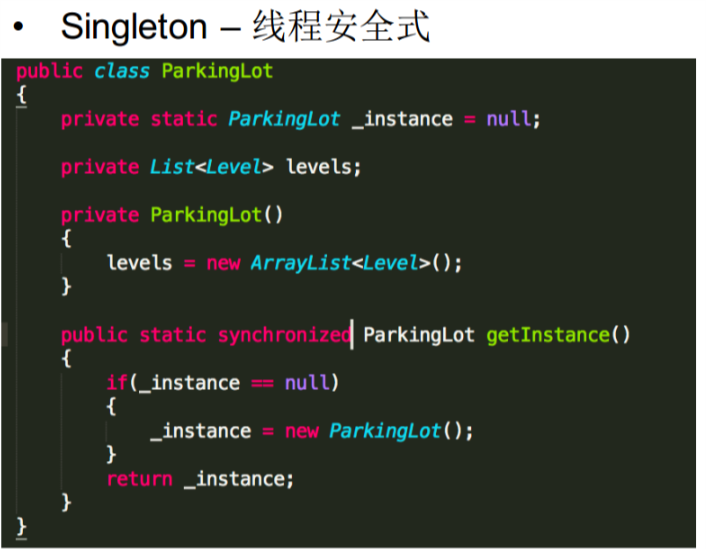
- 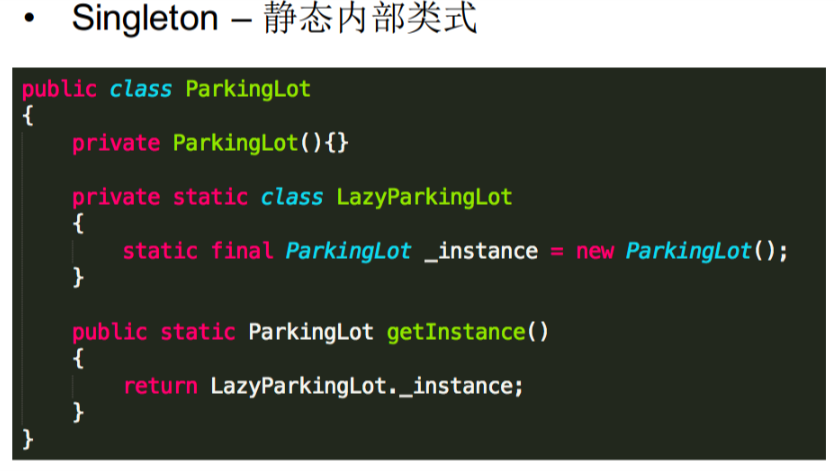


### Question
- static class/method/attribute
```java
public class ParkingLot{
    private static ParkingLot _instance = null;

    private ParkingLot(){
        levels =  new ArrayList<Level>();
    }

    //为什么是static
    //因为用ParkingLot class 来调用getInstance()
    //ParkingLot.getInstance() 
    //Not ParkingLot parkingLot =  new ParkingLot(); parkingLot.getInstance() 

    public static ParkingLot getInstance(){
        if(_instance == null){
            _instance =  new ParkingLot();
        }
        return _instance;
    }
}

public class ParkingLot{

    private ParkingLot(){
    }

    //当static内部类，static类build的时候就被执行了
    // 而且是final的只执行一次
    private static class LazyParkingLot(){
        static final ParkingLot _instance = new ParkingLot();
    }

    public static ParkingLot getInstance(){
        return LazyParkingLot._instance;
    }
}
```

