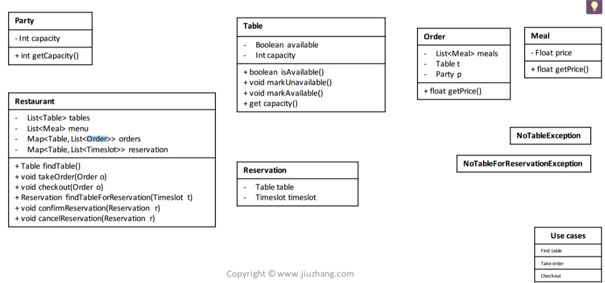
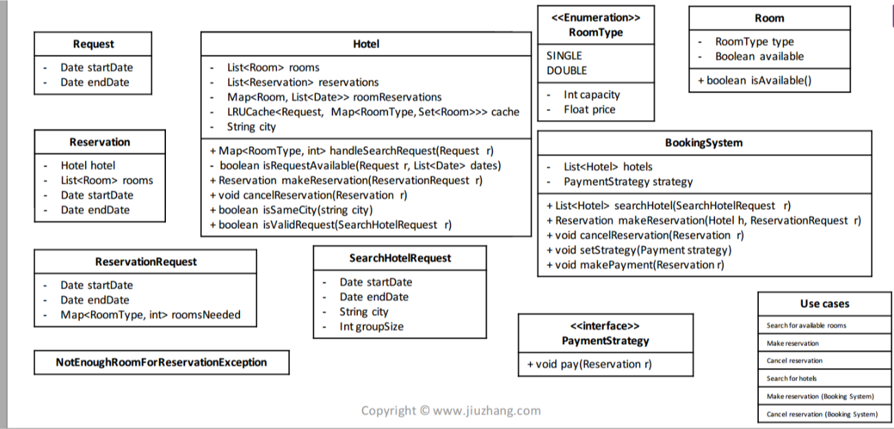

## Reserve
- search 
    - Base on search criteria
    - Go through rooms to check availability
    - List available room types and available count

- select (make reserviation)
    - add roomType, time, and number of rooms in a request
    - send request to hotal
    - if there is engouth room left, confirm the reservation
    - if there isn't enought room left, throw exception 
- cannal 

### restaurant
- 

- chanllge 
    - How to handler reservation?
        -  可以预定：直接进入Confirm阶段
        -  不能预定： Throw exception / Show message
         - Design:  Map<Timeslot, Set<Table>> findTableForReservation(Time slot) throws NoTableForReservationException
         - void confirmReservation( Reservation reservation)
         - void cannalReservation( Reservation reservation)
            - Reservation
                - Table table
                - Timeslot timeSlot

    - How to know if a table is open for reservation for a timeslot?
        - base on Timeslot, 比如一个timeSlot 是2小时。 一个客户预约2点#3桌子，然后timeSlot就说2-4点. 
            Map<Timeslot, Set<Table>>
                 2-4，       #3
        - 保存一个Centralized的Map, 有被confirm过的timeslot就插入这个Map.
            Map<Timeslot, Set<Table>>
            当query一个新的timeslot的时候，检查这个区间内已经被预定过的Table,
            排除之后剩下的就是可选的桌子，随意选一张即可

### Hotal
- Search room from one hotal by loaction and time?
    - Search criteria-> search() -> List<result> -> Select() -> Receipt
        - result should be room type
    - 

    - Q: 
        - 用户search输入什么，返回什么？
        - 用户reserve 输入什么，返回什么？
        - 用户输入时间返回什么List<result>？
        - 用户输入时间和房型和房间个数，返回一个什么？

    - List<Room> room, List<Room, List<Date>> roomReservations
    - searchRequest (Data startDate, Data endDate)
        - base on the request return a Map<roomType,Set<Room>> (通过时间，去 roomReservations return a Map<RoomType,Set<Room>>)
    - makeResrvation (ReservationRequest r)
        - ReservationRequest (Data startDate, Data endDate, Map<rootTpye, #rooms>) 通过Map<rootTpye, #rooms>去request的返回的Map<roomType,Set<Room>> 返回一个Reservation(startTime, endTime, Set<room>)

- Search all hotal by loaction and time?
    - Search criteria-> search() -> List<result> -> Select() -> Receipt
        - result should be room type
    - 

    - List<Room> room, List<Room, List<Date>> roomReservations
    - searchHotalRequest (Data startDate, Data endDate, City, ZipCode)
        - base on the request return a List<Hotal> (通过时间，去 roomReservations return a Map<RoomType,Set<Room>>)
    - searchRequest (List<Hotal>,Data startDate, Data endDate)
        - base on the request return a Map<roomType,Set<Room>> (通过时间，去 roomReservations return a Map<RoomType,Set<Room>>)
    - makeResrvation (ReservationRequest r)
        - ReservationRequest (Data startDate, Data endDate, Map<rootTpye, #rooms>) 通过Map<rootTpye, #rooms>去request的返回的Map<roomType,Set<Room>> 返回一个Reservation(startTime, endTime, Set<room>)