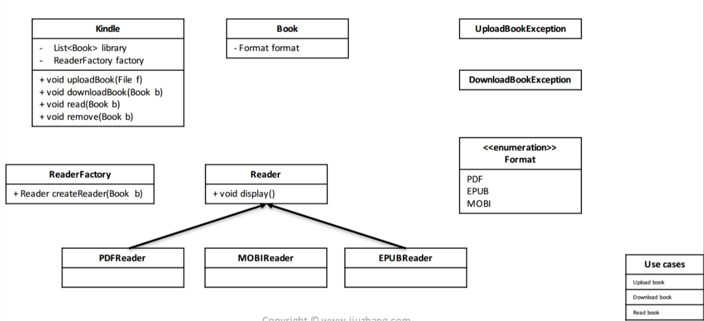

# Object

## 
- Stat pattern
- Decorate pattern
    - 
    ```java
    public class Expresso extends Coffee{
        public Expresso(){
            desription = "Expresso";
        }

        public double cost(){
            return 1.99;
        } 
    }


    public class Mocha extends CoffeeDecorator{
        Coffee coffee;

        public Mocha(Coffee coffee){
            this.coffee = coffee;
        }

        public String getDesription(){
            desription = "Expresso";
            return coffee.getDesription() + " Mocha";
        }

        public double cost(){
            return coffee.getCost() + 0.5;
        } 
    }

    public void test(){
        Coffee coffee1 = new Expresso();
        Coffee coffee2 = new Mocha(coffee1);
        Coffee coffee3 = new Mocha(coffee2);
    }
    ```
    - https://web.cs.dal.ca/~jin/3132/lectures/dp-06.pdf
    - https://www.tutorialspoint.com/design_pattern/decorator_pattern.htm
- Factory pattern
    - 
    - https://www.tutorialspoint.com/design_pattern/factory_pattern.htm


