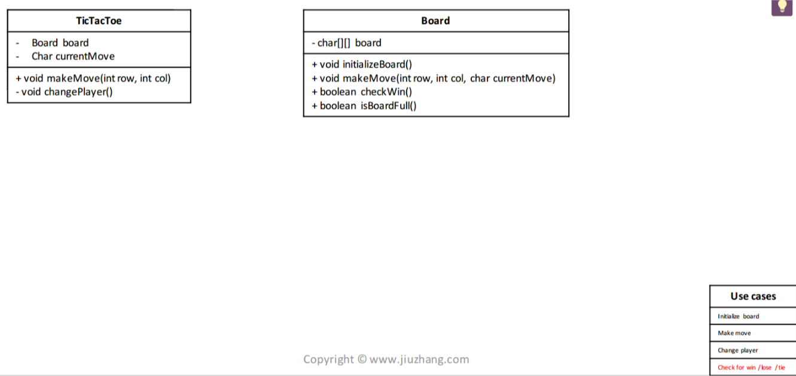
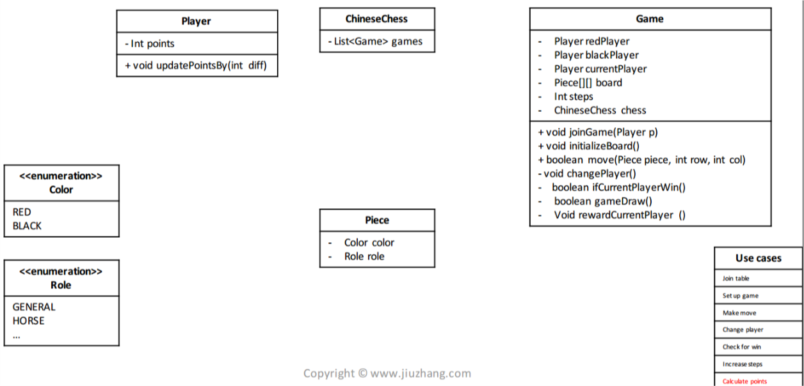
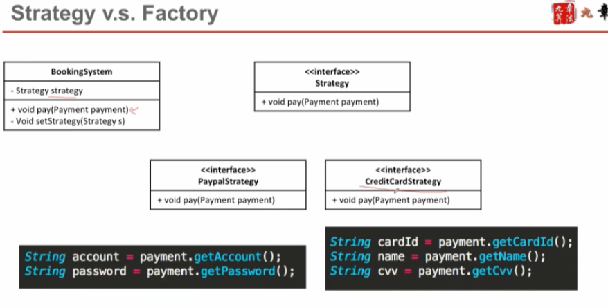
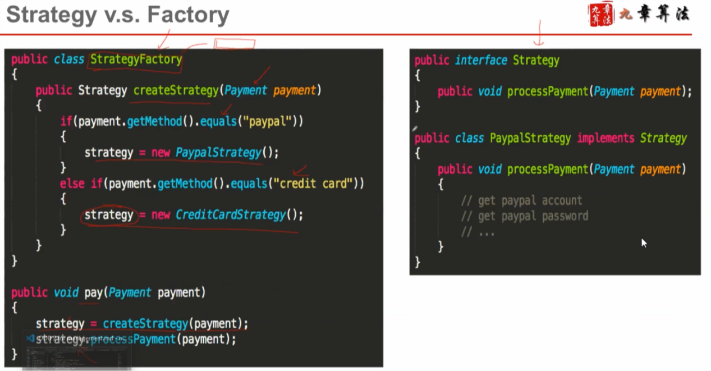

# Game

- Player
    - 如果没有积分 就不需要Player类
- rules
- winning or losing
- credits
- timer 

- 棋牌类术语 (Core Object)
Board
Suit
Hand

- State (Use cases)
Initialization (摆盘，洗牌…)
Play (下棋，出牌…)
Win/Lose check (胜负结算)+ Tie (流局)

- 
- 

- singleton
- Strategy VS Factory
    - Factory is about creating.
    - Strategy is about behavior 
    -     
    - 