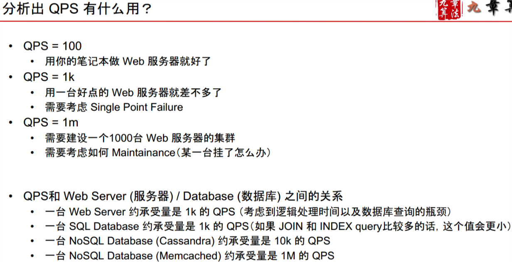
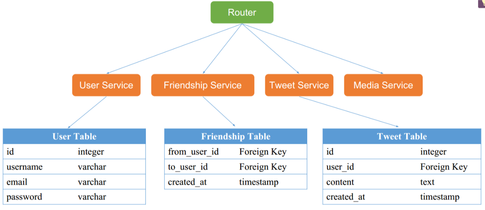
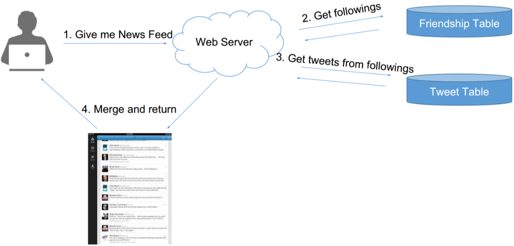
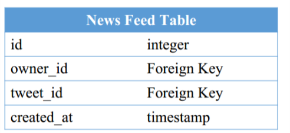
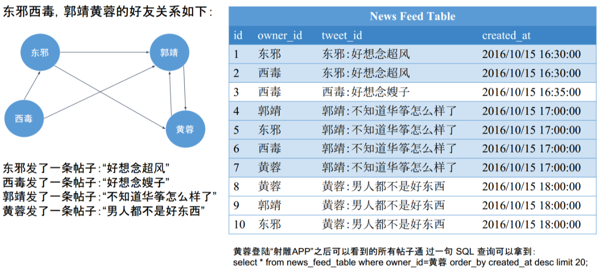
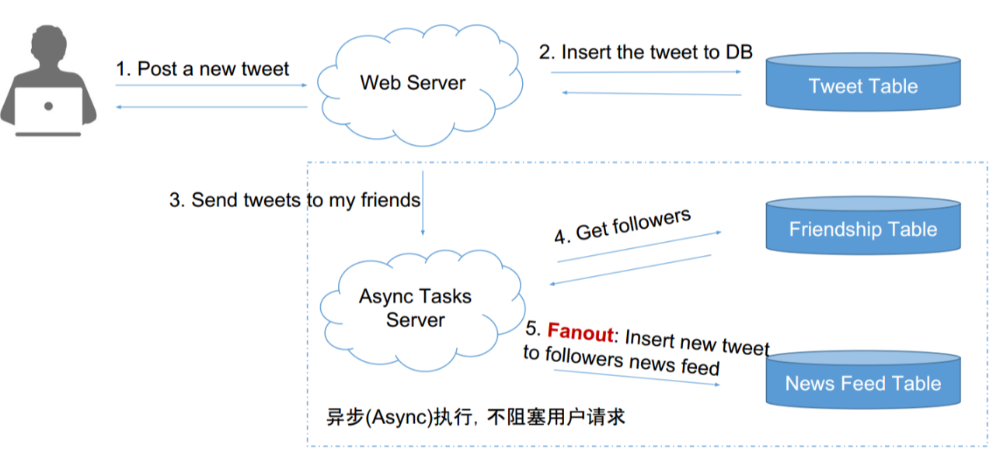
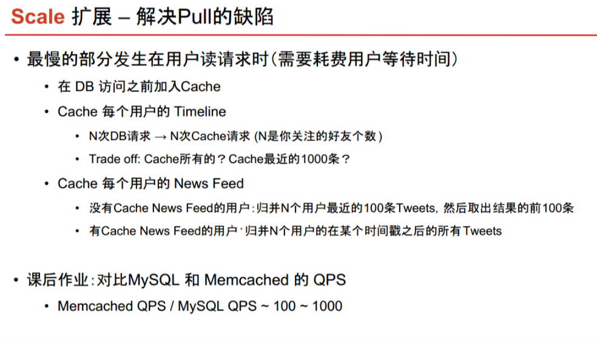
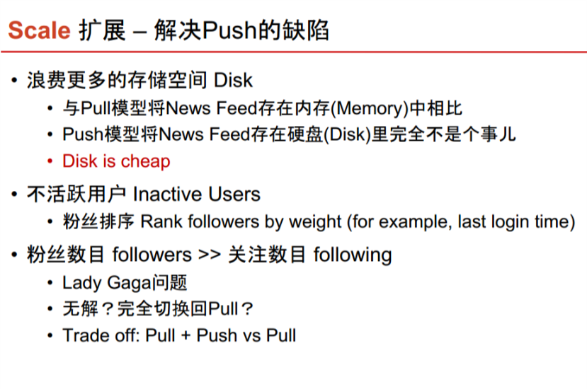
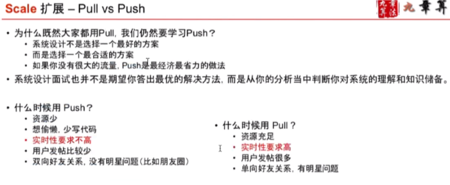

# Introducing System Design & News Feed System

系统设计考的是：Database, Schema, SQL, NoSQL, Memcached, File System, Distributed System, Latency,
Scalbility, Master Slave, Load Balancer, Web Server, Message Queue, Sharding, Consistent Hashing, QPS

- 4S
- Scenario：需要设计哪些功能，设计得多牛
    - Ask / Features / QPS / DAU / Interfaces
        -  
- Service： 将大系统拆分为小服务
    - Split / Application / Module
- Storage 数据如何存储与访问
    - Schema / Data / SQL / NoSQL / File System
- Scale 解决缺陷，处理可能遇到的问题
    - Sharding / Optimize / Special Case

Ex: Design Twitter
- Scenario:
    - Enumerate: list Twittter 功能
    - Sort: select core 功能
    - Analysis & Predict
        - 得到 Concurrent User （日活跃 * 每个用户平均请求次数 / 一天多少秒) Peek and Fask Growing =  peak user *2;
        - 得到 read QPS and write QPS 通过 Monthly Active Users, Daily Active User.
        - Ex: Concurrent User = 50M * 60 / 86400~ 100k， peak = Concurrent User*3, read QPS = Concurrent User, write QPS = read QPS /6

- Service: 同一类的服务放到一起服务
- Storage 
    - DataBase : user table (structure data)
    - No Sql dataBase: tweets/social graph (structure data)

    - file system: 图片视频 (UN structure data)
    - Cache :Nonpresistent (MemCacheD)

- Please design schema

- News Feeds
    - Pull Model  
        - 读取数据库次数 不是常数级 
        - N次DB Reads非常慢 且发生在用户获得News Feed的请求过程中，会卡住 其他service
    - Push Model
        - 为每个用户建一个List存储他的News Feed信息
        - 用户发一个Tweet之后，将该推文逐个推送到每个用户的News Feed List中 （Fanout）
        - 用户需要查看News Feed时，只需要从该News Feed List中读取最新的100条即可
        - News Feed => 1次DB Read
        - Post a tweet => N个粉丝，需要N次DB Writes
            - 好处是可以用异步任务在后台执行，无需用户等待
        
                 
         
    
    - Scale
         
         
         
         