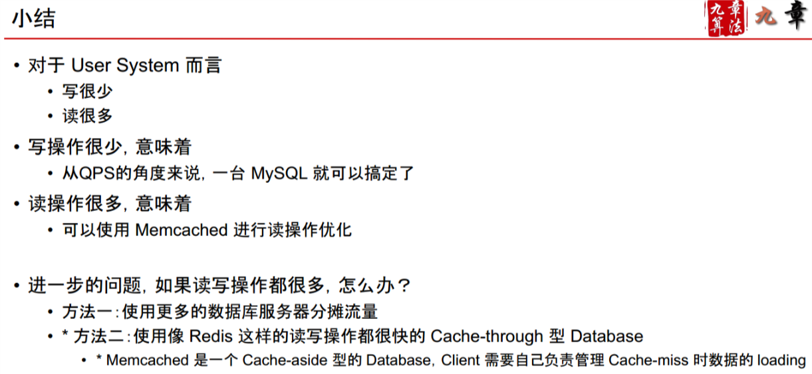
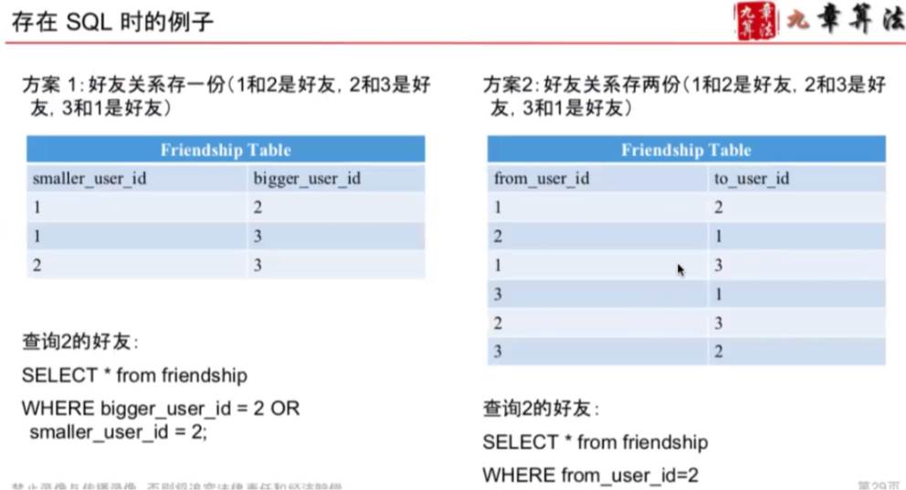
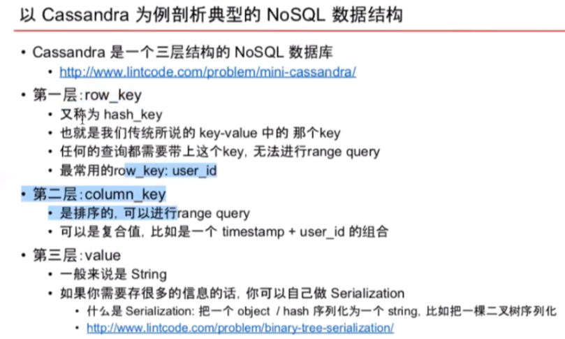
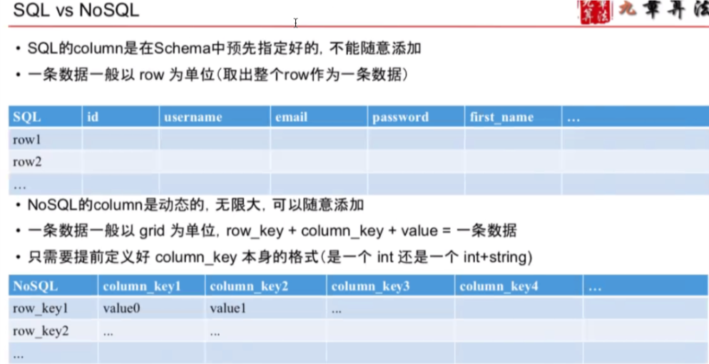
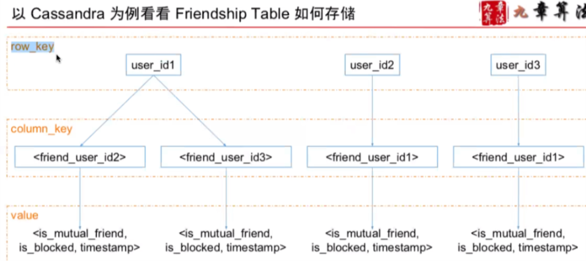
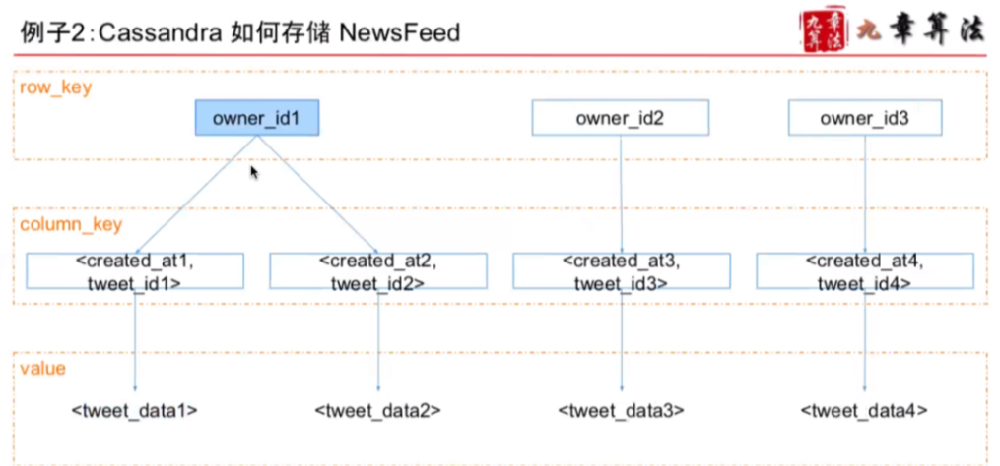
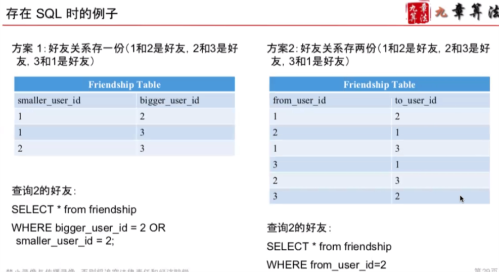
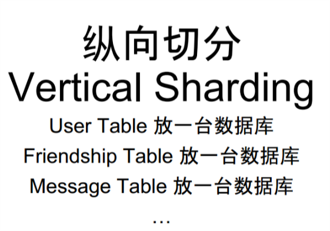
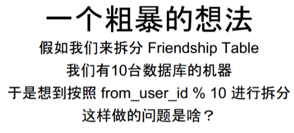
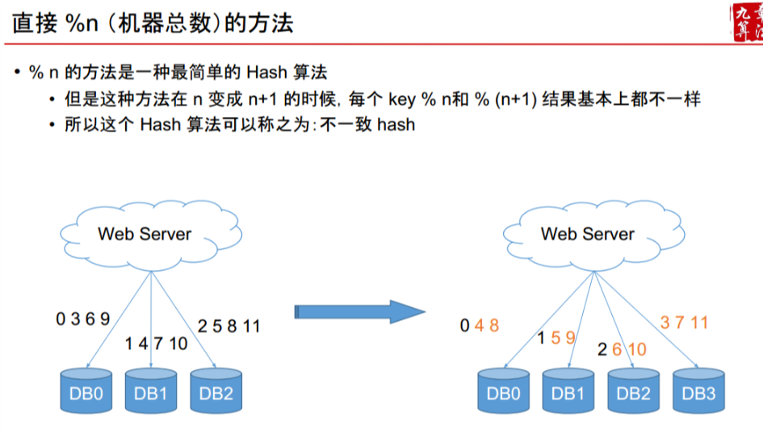

- 4S
- Scenario：需要设计哪些功能，设计得多牛
    - Ask / Features / QPS / DAU / Interfaces
        - 通过QPS选择数据存储系统
        - 读多写少用cache
        - file system 适合做网络服务的cache，因为网络服务比file system
        - 
        - Cache Aside(Memcached + MySQL) VS Cache Through (Redis)

- Service： 将大系统拆分为小服务
    - Split / Application / Module
- Storage 数据如何存储与访问
    - Schema / Data / SQL / NoSQL / File System
        - SQL vs NoSQL
            - 大部分的情况，用SQL也好，用NoSQL也好，都是可以的
            - 需要支持 Transaction 的话不能选 NoSQL
            - 如果想省点服务器获得更高的性能，NoSQL就更好 硬盘型的NoSQL比SQL一般都要快10倍以上
            - NoSQL很多事儿都要亲力亲为(Serialization, Secondary Index)
            - 
            - 
            - 
            - 
            - 
            - 因为好友关系 读多写少 所以方案2 更好
                 - 
            - 如果要查看粉丝 在NoSql,但是对于SQL只需要一个表，因为支持多项查询
                - 新建一个新表 disk is cheap
            - User table

- Scale 解决缺陷，处理可能遇到的问题
    - Sharding / Optimize / Special Case
        - Single Point Failure
            - 用多台机器
                - sharding: 按照一定的规则，将数据拆分成不同的部分，保存在不同的机器上
                    - 
                    - 
                        - 

                - replica: 通常的做法是一式三份（重要的事情“写”三遍） & 同时还能分摊读请求