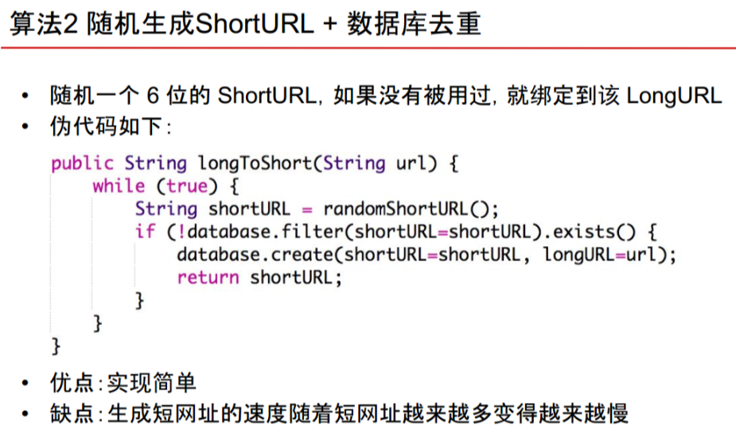

### Consistent Hashing

- Consistent Hashing
    - 
    - 
    - 缺陷1 数据分布不均匀 因为算法是“将数据最多的相邻两台机器均匀分为三台” 比如，3台机器变4台机器时，无法做到4台机器均匀分布
    - 新机器的数据只从两台老机器上获取 导致这两台老机器负载过大
    - 

- Replica
    - backup VS Replica
    - MySql Replica
    - write ahead log 
    - Sql vs NoSql in Replica

### Short Url
- Scenario 
    - QPS 
- Service
    - URL service 
        - get feature
        - set feature
- Storage
    - Sql VS No Sql 
    - 
        - 自增就必须加锁，会导致很慢
        - 不安全 
    
    - 算法 如何将 Long Url 转换为一个 6位的 Short Url？
        - 
        - 
            - SQL 型数据库表 如何设计？
            - 基于随机生成方法的 Work Solution
        - 
             - SQL 型数据库表 如何设计？
            - 基于随机生成方法的 Work Solution

- Scale
    