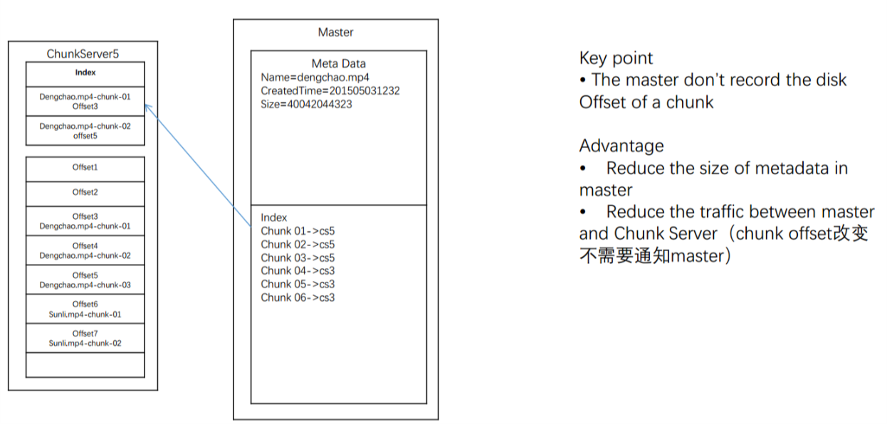

### Master Slave Pattern.
### How to check and handle system failure and error.
### How to design Distributed File System.

### Scenario 
- Peer to peer
    - Master + Slave
        - DB
            - Master: store data 
            - Slave: Backup
        - HDFS
            - manager
            - store data, partiion
    - Interview Questions:
        - how disk to save file
            - 
        - How to save a large file in one machine?
            - EX: ECS 128M (chunk)
                - Advantage: reduce size of metadata
                - DisAdvantage: Waste space of small files
        - How to save extra-large file?
            - 
        - 每个chunk的Offset偏移量可不可以不存在master上面?
            - 
        - Master 存储10P 文件的metadata需要多少容量?
           10G
    - Interviewer: How to write a file?
        - 一次 VS 多次
            - 写入过程中出错了，那么需要重新写入，哪一种方法更好？ 一次传输得重新传输整个文件，多次只用重新传一小份。
            -  如果是分成多份多次写入，那么每一份的大小？ 文件本来是按照Chunk来存储的，所以传输单位也是Chunk
        - 
            - Clint asks chunk 个数 to master
            - master reutrn the chunk index
            - clinet finds the chunk from chunkServer
    - 要修改xxx.mp4怎么办？
        - One time to write, Many time to read.
            - 先删掉/gfs/home/dengchao.mp4
            - 重新把整个文件重写一份
    - How to read a file?
        - 

### Our work solution

### Scale about the Failure and Recover
- How to identify whether a chunk on the disk is broken?
        - Checksum
    - 什么时候写入checksum?
        - 写入一块chunk的时候顺便写入
    - 什么时候检查checksum?
        - 读入这一块数据的时候检查
            - 重新读数据并且计算现在的checksum
            - 比较现在的checksum和之前存的checksum是否一样

- How to avoid chunk data loss when a Chunk Server is down/fail?
    - Replica

- How to recover when a chunk is broken? & How to recover when a chunk is broken?
    - Ask master for help 

- How to find whether a Chunk Server is down?
    - Answer: Heart Beat
        - chunk servers->master?

- Scale about the Write
    - [soultion 1](./assets/chap1_35.png)
    - [Better soultion](./assets/chap1_36.png)
        - 怎么样选队长?
            - 找距离最近的（快）
            - 找现在不干活的（平衡traffic）

    - How to solve Chunk Server failure? 
        - retry (重新分配)

    https://www.jiuzhang.com/qa/627/
    什么情况用sstable vs lsm tree