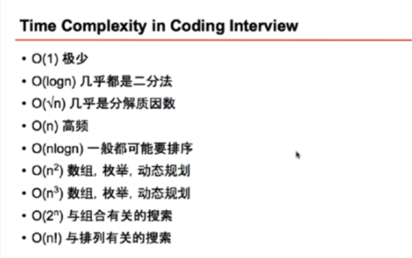
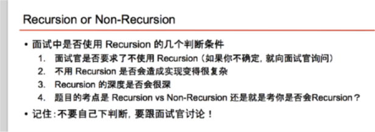

https://zhuanlan.zhihu.com/p/56943330
https://link.zhihu.com/?target=http%3A//wowubuntu.com/markdown/basic.html
https://segmentfault.com/markdown




# Binary Search
#### 时间复杂度  `T(n) = O(1) + T(n/2) = O(1) + T(n/4) + O(1) + T(n/4) ... = O(log n) ` 
`最终T(n) -> T(1) 需要0(log n)次. Ex: 0(8) => 0(8/2) + O(8/4) + O(8/8)`

#### tips
1. over dead loop
   > `start + 1 < end`
2. How to do loop 
3. How to move the point


#### Example


#### Example
- "First Postition of Target" [14]
```java
// version 2: without jiuzhang template
class Solution {
    /**
     * @param nums: The integer array.
     * @param target: Target to find.
     * @return: The first position of target. Position starts from 0.
     */
    public int binarySearch(int[] nums, int target) {
        if (nums == null || nums.length == 0) {
            return -1;
        }
        
        int start = 0, end = nums.length - 1;
        while (start < end) {
            int mid = start + (end - start) / 2;
            if (nums[mid] == target) {
                end = mid;
            } else if (nums[mid] < target) {
                start = mid + 1;
            } else {
                end = mid - 1;
            }
        }
        
        if (nums[start] == target) {
            return start;
        }
        
        return -1;
    }
}
```

#### Questions
[14]: https://www.lintcode.com/problem/first-position-of-target/description/ "First Postition of Target"

## Recursion

#### disadvantage
1. Statk

